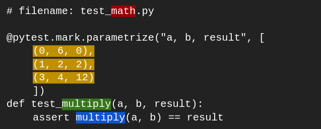
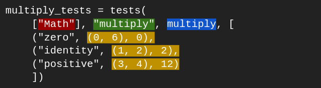

# Introduction

`fununit` ("**fun**ctional **unit** testing") is a functional, declarative unit-testing library for testing pure functions in Python.

Here are some key features:

- **functional:** fununit has a functional API, which means it has great composability and flexibility
- **declarative:** fununit lets you describe unit tests in a fully declarative manner
- **cuts out all code duplication:** fununit removes up to 100% of unnecessary code duplication between tests

All of this makes tests more maintainable - and more fun to write ;)

# Installation

You can install fununit from PyPI:

`pip install fununit`

# Basic Usage

Due to its API being made up of pure functions, fununit is very flexible. You can customize almost any part of it, including making any testing flow you could want. Despite that, it's easy to get started with, using a basic testing flow.

Remember, fununit is for testing pure functions. Let's use this one as a simple example:

```python
def multiply(a, b):
    return a * b
```

So, we want to create unit tests for this function. But, unit tests start with test cases, so I'll cover those first.

Fununit provides a type called `TestCase`. A `TestCase` has three properties:

- `case_name`, the name of the test case
- `parameters`, the parameters that define the test case
- `expected`, the value you expect given those parameters

Use the `TestCase.create` function to create test cases:

```python
TestCase.create("zero", (0, 6), 0)
TestCase.create("identity", (1, 2), 2)
TestCase.create("positive", (3, 4), 12)
```

Then, we can turn those test cases into unit tests. The `UnitTest` type has six properties that we care about:

- `tags`, you can tag unit tests with anything you want, for example, the module name
- `function_name`, the name of the function being tested
- `function`, the function itself
- the same three as `TestCase`: `case_name`, `parameters`, and `expected`

As you can see, a `UnitTest` is just a `TestCase` with some extra information. This means we can take our test cases and make them into full unit tests. The normal way to do this is using the `UnitTest.from_cases` function.

Let's do that. We'll pass in a list of tags (in this case, one tag to show that this function is part of our Math module), the name of the function, and the function itself. Then, we give it the list of test cases we want to have.

```python
from fununit import TestCase, UnitTest

multiply_tests = UnitTest.from_cases(
    ["Math"], "multiply", multiply, [
        TestCase.create("zero", (0, 6), 0),
        TestCase.create("identity", (1, 2), 2),
        TestCase.create("positive", (3, 4), 12)
    ])
```

Note: You may like having `TestCase.create` for each test case, as it is very explicit about what you are creating. However, fununit has a more implicit, less verbose approach if you prefer it. This example uses the `UnitTest.from_cases_implicit` function, and even imports it as `tests` for some very succinct code.

```python
from fununit.UnitTest import from_cases_implicit as tests

multiply_tests = tests(
    ["Math"], "multiply", multiply, [
        ("zero", (0, 6), 0),
        ("identity", (1, 2), 2),
        ("positive", (3, 4), 12)
    ])
```

Even more possibilities are shown in the "Verbosity Levels When Describing Tests" section below. (This includes specifying parameters as a dictionary!) Whichever format you choose, we now have a finished set of unit tests for the multiply function, described using fununit. The easiest way to run them is to use the default test runner:

```python
from fununit.run import run_tests

run_tests(multiply_tests)
```

The console output of the default test runner looks like this (with a failing case for demonstration):

```
PASSED [Math] multiply.zero
PASSED [Math] multiply.identity
PASSED [Math] multiply.positive
FAILED [Math] multiply.negative
    parameters = [-2, -5]
    expected = 10
    actual = -10
```

Check out example.py and the advanced usage section for more.

# Advanced Usage

## Full API

### TestCase module

- `TestCase` type
  - represents an independent test case
  - has properties:
    - `case_name`
    - `parameters`
    - `expected`
- `create(case_name, parameters, expected)`
  - creates a `TestCase`

### UnitTest module

- `UnitTest` type
  - represents one full unit test
  - has properties:
    - `equality_fn` - see section "Value Equality in Fununit"
    - `tags`
    - `function_name`
    - `function`
    - `case_name`
    - `parameters`
    - `expected`
- `create(tags, function_name, function, case_name, parameters, expected)`
  - creates a `UnitTest` with the default equality function
- `from_case(tags, function_name, function, test_case)`
  - creates a `UnitTest` from a `TestCase`
- `from_cases(tags, function_name, function, test_cases)`
  - creates many `UnitTests` for a single function from many `TestCases`
- `from_cases_implicit(tags, function_name, function, test_case_tuples)`
  - same as `from_cases` but instead of passing in a list of `TestCases`, you pass in a list of 3-tuples representing them
  - e.g. `TestCase.create("identity", (1, 4), 4)` becomes `("identity", (1, 4), 4)`
- `from_cases_with_tags(tags)`
  - a convenience function that returns a function like `from_cases` but with the `tags` baked in
  - can be useful to make several sets of unit tests with the same tags, without needing to rewrite the tags each time

### TestResult module

Note: It is unlikely that you will use any of the functions in this module if you are just writing unit tests. They are available, however, if you decide you need them, for example, if you are writing a custom test runner.

- `TestResult` type
  - represents the result of one unit test
  - has properties:
    - `tags`
    - `function_name`
    - `case_name`
    - `parameters`
    - `expected`
    - `actual`
    - `passed`
- `create(tags, function_name, case_name, parameters, expected, actual, passed)`
  - creates a `TestResult`
- `get_actual_from_test(unit_test)`
  - gets the actual result of running the test
- `from_test(unit_test)`
  - creates a `TestResult` from a `UnitTest` by running the test
- `from_tests(unit_tests)`
  - creates many `TestResults` from many `UnitTests` by running each test

### run module

- `run_tests(unit_tests)`
  - runs the given `UnitTests` and displays the results in the console
- `run_tests_list_display(show_result_fn, unit_tests)`
  - a convenience function that runs the given unit tests and lets you specify how each TestResult should be shown
  - `show_result_fn` is a function that accepts a `TestResult` and returns a string representation of it
- `run_tests_batch_display(show_results_fn, unit_tests)`
  - a convenience function that runs the given unit tests and gives you full control of how test results are shown
  - `show_results_fn` is a function that accepts a list of `TestResults` and returns a string representation of them

## Verbosity Levels When Describing Tests

There are several levels of verbosity that you can use when you write tests with basic fununit. Many things might affect your choice of which to use, such as personal opinion or complexity of the function being tested.

```python
from fununit.UnitTest import from_cases_implicit as tests

multiply_tests = tests(
    ["Math"], "multiply", multiply, [
        ("zero", (0, 6), 0),
        ("identity", (1, 2), 2),
        ("positive", (3, 4), 12)
    ])
```

```python
multiply_tests = UnitTest.from_cases(
    ["Math"], "multiply", multiply, [
        TestCase.create("zero", (0, 6), 0),
        TestCase.create("identity", (1, 2), 2),
        TestCase.create("positive", (3, 4), 12)
    ])
```

```python
multiply_tests = UnitTest.from_cases(
    ["Math"], "multiply", multiply, [
        TestCase.create(
            case_name = "zero",
            parameters = (0, 6),
            expected = 0),
        TestCase.create(
            case_name = "identity",
            parameters = (1, 2),
            expected = 2),
        TestCase.create(
            case_name = "positive",
            parameters = (3, 4),
            expected = 12)
    ])
```

```python
multiply_tests = UnitTest.from_cases(
    ["Math"], "multiply", multiply, [
        TestCase.create(
            case_name = "zero",
            parameters = {
                "a": 0,
                "b": 6
            }
            expected = 0),
        TestCase.create(
            case_name = "identity",
            parameters = {
                "a": 1,
                "b": 2
            }
            expected = 2),
        TestCase.create(
            case_name = "positive",
            parameters = {
                "a": 3,
                "b": 4
            }
            expected = 12)
    ])
```

## Fun Possibilities

- Create a list of test cases that are agnostic to any particular function implementation. Then, reuse the test cases across different function implementations.
  ```python
  UnitTest.from_cases(["Sorting"], "bubble_sort", bubble_sort, sorting_test_cases)
  UnitTest.from_cases(["Sorting"], "merge_sort", merge_sort, sorting_test_cases)
  ```
- Create test case data providers that can provide test case data in different formats, such as JSON, XML, or CSV.
- Report the results of tests to a file, like a CSV.
- Any filtering or sorting of test cases, unit tests, and test results you could possibly imagine.
- Generate tests programatically for property-based testing.
- Write any integration you want with external tools like CI pipelines.

## Value Equality in Fununit

The `UnitTest` type has another property not discussed in the Basic Usage section: `equality_fn`. This property defines the function that should be used to determine whether the actual result of the test is equal to the expected result. Fununit has a default equality function that it uses for the built-in `UnitTest` functions. However, the property remains so that you can use a custom equality function if you want to.

Fununit's default equality function is meant to be better for its users than `==`. As fununit is for testing pure functions, `==` is useless when it does object reference comparisons instead of value comparisons. So, fununit's default equality function compares lists and tuples element-wise and dictionaries by their keys and associated values. It also compares user-created class types by their properties. This means you can use classes like this:

```python
class Person:
    name = None
    address = None
    phone_number = None
    # None as the default value just for example
```

and fununit will compare all the property values to determine equality. All other types are compared using `==`.

# Advantages of Fununit

## Writing Tests

If you were to compare fununit to another testing framework in terms of functionality offered and how you describe tests, a close comparison would be pytest with parametrize, as both do parameterized testing. I'll do a side-by-side comparison.

### pytest with parametrize:


### fununit (using succinct style explained above):


There are many common elements between the two (regardless of structure of the elements):
| Element | pytest and parametrize | fununit |
| --- | --- | --- |
| Named group of separate functions being tested together | `test_math.py` is the name of the file/module where `test_multiply` is defined | `"Math"` is a tag in a parameter to `UnitTest.from_cases` |
| Name of the function being tested | `test_multiply` is the name of the test function | `"multiply"` is a parameter to `UnitTest.from_cases` |
| Function being tested | `multiply` is called directly with parameters in the `assert` statement | `multiply` is a parameter to `UnitTest.from_cases` |
| Parameters of each test case | the `a` and `b` elements of each 3-tuple given to `@pytest.mark.parametrize` | the elements of the second parameter to each `TestCase.create` |
| Expected result of each test case | the `result` element of each 3-tuple given to `@pytest.mark.parametrize` | the third parameter to each `TestCase.create` |

There is one glaring uncommon element: fununit test cases are required to have a name.

And there are plenty of structural differences in how those common elements are laid out, which is where fununit really shines.

- With pytest, you write "a," "b," and "result" three separate times. Fununit's abstraction is designed around this style of testing, so you write them zero times.
- With pytest, you need to write an imperative `assert` statement. Granted, it is a very simple statement. However, it is still less composable than the expressions that fununit uses.  
- Pytest is syntax-heavy. You have a decorator, you need to define a new function using the `def` keyword, you need to use the `==` operator and the `assert` keyword. Fununit just has functions and values, which improves combosability.
- Pytest has (relatively) a lot of redundancy and repetition. Every test you write will need the parametrize decorator, and you'll need to define a test function with an assert statement in it. With fununit, you have the option to cut out all unnecessary repetition, and only provide the things that actually matter for each unit test.

These advantages are nuanced, to be sure. There's nothing wrong with pytest's parametrize, in fact it is actually pretty nice. But unit testing is so common that I think it is worth it to take something pretty good and improve that last little bit.

**All in all, it comes down to this:** fununit provides similar functionality to parameterized unit testing, but with a moderately higher level of abstraction, more structure, and more flexibility for the user to extend it with custom functionality.

## More Than Writing Tests

The advantages of fununit go beyond just what it looks like to write tests, though. Fununit provides a clear, solid structure for a new way to think about unit testing, and it makes it very easy to access and extend any level of that structure. You of course get all the built-in functionality, but that's just the foundation. From there, you get to decide where you take the ideas that fununit offers, whether that's writing cool things on top of fununit's core, or taking the types and rewriting everything else. (In either case, consider contributing to fununit!)

## Assorted Benefits

- **Functional Approach:** Fununit is based on functional programming concepts, which allows for a more modular, composable and reusable way of writing and structuring tests. This can make it easier to understand and maintain the test codebase.
- **Declarative Testing:** Fununit's approach is fully declarative, which allows the user to expressively describe the tests that they want, not how they should be run.
- **Test Case Management:** Fununit allows for better management of test cases, as it lets the user isolate the them. This allows for better organization and reusability of test cases.
- **Test Result Management:** Fununit allows for better management of test results, as it explicitly treats test results as their own type. This allows for better organization and analysis of test results.
- **Flexible Test Reporting:** Fununit allows full control over the test reporting process, which can be useful for customizing the results display, generating reports in different formats, or integrating with other tools.
- **Custom Test Runners:** Fununit makes it easy to make custom test runners, which can be useful for adapting the test execution process to specific needs. This can be useful for adding custom logic or hooks for test execution.
- **Programmatic Control of Test Execution:** Fununit gives users programmatic control over the test execution process. This means that users have full control over when, how, and which tests are run.
